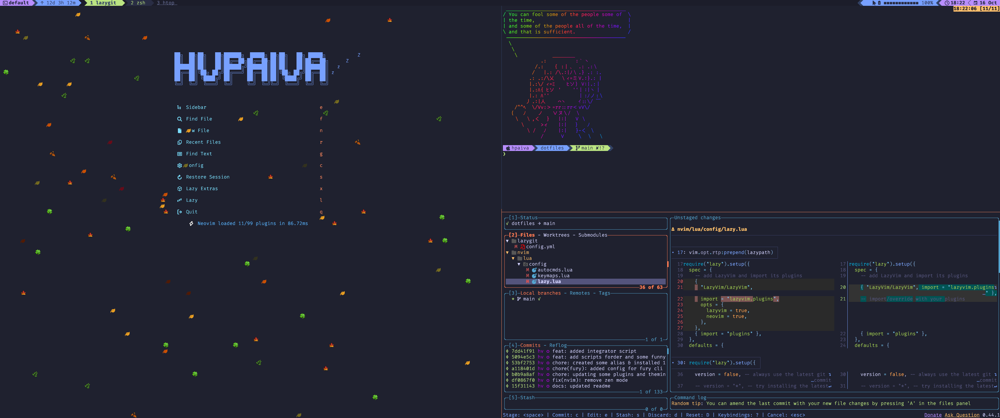
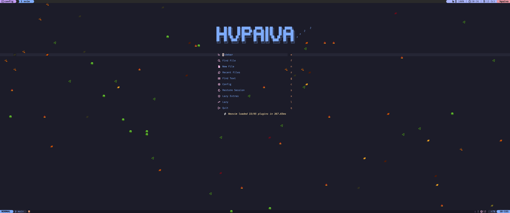

# Dotfiles

```sh
██████╗  ██████╗ ████████╗███████╗██╗██╗     ███████╗███████╗
██╔══██╗██╔═══██╗╚══██╔══╝██╔════╝██║██║     ██╔════╝██╔════╝
██║  ██║██║   ██║   ██║   █████╗  ██║██║     █████╗  ███████╗
██║  ██║██║   ██║   ██║   ██╔══╝  ██║██║     ██╔══╝  ╚════██║
██████╔╝╚██████╔╝   ██║   ██║     ██║███████╗███████╗███████║
╚═════╝  ╚═════╝    ╚═╝   ╚═╝     ╚═╝╚══════╝╚══════╝╚══════╝
```

<a href="https://github.com/hvpaiva/dotfiles/actions/workflows/tests.yml">
  
</a>
<a href="https://opensource.org/licenses/MIT">
  
</a>




All the configuration and scripts needed by myself, proper dotfiles are the
very heart of an efficient working environment, no more, no less.

All configurations are managed by [Ansible](https://github.com/ansible/ansible),
it's a little more complex than [GNU Stow](https://www.gnu.org/software/stow/),
[dotbot](https://github.com/anishathalye/dotbot), but much features rich to
bootstrap my environment.

Please NOTE that this project isn't a distro, it's intended for my personal
usage, and perhaps some inspiration, _not complete duplication_. If you see
something weird or wrong please raise an issue instead.

## Setup

Cloning Dotfiles

```sh
git clone git@github.com:hvpaiva/dotfiles.git
```

Navigate to the project directory and run the `setup.sh` playbook.

```sh
cd dotfiles && ./setup.sh
```

> [!NOTE]
> To run the configuration, the sudo password is required. This will only be requested the first time, after which it will be securely stored on your machine.
> Make sure to remove it if the machine is not a secure environment.

## Manifest

- Terminals:
  - [kitty](https://sw.kovidgoyal.net/kitty/)
  - [wezterm](https://github.com/wez/wezterm)
  - [tmux](https://github.com/tmux/tmux)
- Shell:
  - [zsh](https://www.zsh.org/)
  - [zinit](https://github.com/zdharma-continuum/zinit)
  - [starship](https://github.com/starship/starship)
- Editor:
  - [neovim](https://github.com/neovim/neovim)
- Theme:
  - [Catppuccin](https://catppuccin.com/)
- Font:
  - Fira Code _from Nerd Fonts_
- Browser:
  - [nnn](https://github.com/jarun/nnn)
- Version Manager:
  - [asdf](https://github.com/asdf-vm/asdf)
- Others:
  - lazygit
  - gitui
  - bat
  - ideavim
  - cmatrix
- ...

## Contributing

Issues and Pull Requests are greatly appreciated. If you've never contributed to an open source project before
I'm more than happy to walk you through how to create a pull request.

You can start by [opening an issue](https://github.com/hvpaiva/dotfiles/issues/new) describing the problem that you're looking to resolve and we'll go from there.

## License

This project is licensed under the [MIT license](https://opensource.org/licenses/mit-license.php) © Highlander Paiva.

## Acknowledge

This repo is inspired in [jeffreytse](https://github.com/jeffreytse/dotfiles) dotfiles.
